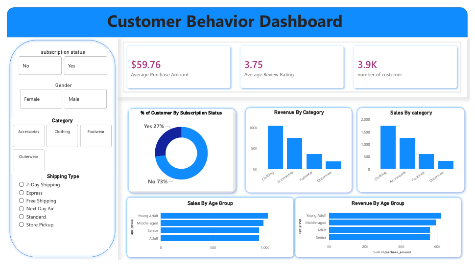

# 📊 Customer Shopping Behavior Analysis

## Overview
This project analyzes customer shopping behavior to uncover patterns in spending, product preferences, and customer loyalty. It covers the full analytics workflow: cleaning and preparing raw data in Python, exploring it for trends, running SQL queries in PostgreSQL to answer business questions, and presenting the findings in an interactive Power BI dashboard.

## Dataset
- **File:** `customer_shopping_behavior.csv`
- **Size:** ~3,900 customer records, 18 columns
- **Key fields:** Customer ID, Age, Gender, Item Purchased, Category, Purchase Amount (USD), Location, Season, Review Rating, Subscription Status, Shipping Type, Discount Applied, Previous Purchases, Payment Method, Frequency of Purchases
- **Description:** Each row represents a single customer's shopping profile, including demographics, purchase details, and behavioral attributes such as subscription status and shopping frequency.

## Tools & Technologies
| Category | Tools |
|---|---|
| Programming | Python (Pandas), Jupyter Notebook |
| Database | PostgreSQL (via SQLAlchemy + psycopg2) |
| Visualization | Power BI |
| Version Control | Git & GitHub |

## Project Steps

### 1. Data Loading
- Loaded `customer_shopping_behavior.csv` into a Pandas DataFrame.
- Inspected structure, data types, and summary statistics with `.info()` and `.describe()`.

### 2. Data Cleaning
- Checked for missing values with `.isnull().sum()`.
- Filled missing **Review Rating** values using the median rating per product **Category**.
- Standardized column names to lowercase, underscore-separated format (e.g., `Purchase Amount (USD)` → `purchase_amount`).
- Created an **age_group** feature (Young Adult, Adult, Middle-aged, Senior) using quantile-based binning on `age`.
- Converted `frequency_of_purchases` (e.g., Weekly, Monthly, Annually) into a numeric `purchase_frequency_days` field for easier analysis.
- Dropped the `promo_code_used` column after confirming it duplicated `discount_applied`.

### 3. Exploratory Data Analysis (EDA)
- Reviewed distributions of age, purchase amount, and review ratings.
- Checked relationships between categorical fields (gender, category, subscription status) and spending behavior.

### 4. SQL Analysis (PostgreSQL)
- Loaded the cleaned dataset into a PostgreSQL database using SQLAlchemy.
- Wrote SQL queries to answer business questions, including:
  - Revenue by gender
  - Customers who used a discount and spent above the average purchase amount
  - Top 10 products by average review rating
  - Average spend by shipping type (Standard vs. Express)
  - Customer count, average spend, and total revenue by subscription status
  - Discount rate by product category
  - Customer segmentation into **New**, **Returning**, and **Loyal** tiers based on previous purchases
  - Top 3 best-selling items within each category
  - Repeat buyer counts by subscription status
  - Revenue by age group

  See the full query set in [`customer_behavior.sql`](customer_behavior.sql).

### 5. Dashboard Development
- Connected the cleaned dataset to Power BI.
- Built KPI cards, bar charts, and a donut chart, with slicers for subscription status, gender, category, and shipping type.
- Designed a single-page dashboard for at-a-glance insights.

## Dashboard
The Power BI dashboard surfaces:
- **KPIs:** Average Purchase Amount ($59.76), Average Review Rating (3.75), Total Customers (3.9K)
- **% of Customers by Subscription Status** — donut chart (No 73% / Yes 27%)
- **Revenue by Category** and **Sales by Category** — bar charts
- **Sales by Age Group** and **Revenue by Age Group** — bar charts
- **Interactive filters:** subscription status, gender, category, shipping type



## Results & Key Insights
- Only 27% of customers are active subscribers, yet the segment is worth examining further for retention opportunities.
- Clothing is the top-performing category by both sales volume and revenue, followed by Accessories, Footwear, and Outerwear.
- Young Adults and Middle-aged customers drive the highest sales volume and revenue, making them the core customer base.
- Average review rating (3.75) suggests generally positive but not exceptional product satisfaction — a potential area for improvement.

## How to Run

### Prerequisites
- Python 3.x with `pandas`, `sqlalchemy`, `psycopg2-binary`
- PostgreSQL installed and running locally
- Power BI Desktop

### Steps
1. Clone the repository:
   ```bash
   git clone https://github.com/your-username/your-repo-name.git
   cd your-repo-name
   ```
2. Install Python dependencies:
   ```bash
   pip install pandas sqlalchemy psycopg2-binary
   ```
3. Run `Customer_Behavior.ipynb` to load, clean, and prepare the data, and push it into your PostgreSQL database.
   > Note: update the database credentials (username, password, host, port, database name) in the notebook to match your local PostgreSQL setup — never commit real credentials to GitHub.
4. Run the queries in `customer_behavior.sql` against your database to reproduce the analysis.
5. Open the Power BI `.pbix` file in Power BI Desktop, point it to your database or the cleaned CSV, and refresh to explore the dashboard.

## Project Structure
```
├── Customer_Behavior.ipynb        # Data loading, cleaning & PostgreSQL export
├── customer_shopping_behavior.csv # Raw dataset
├── customer_behavior.sql          # SQL analysis queries
├── dashboard.pbix                 # Power BI dashboard (add your file)
├── Screenshot_2026-09-17_103759.png # Dashboard preview image
└── README.md
```

## Author
**[Harshal Shirsat]**
📧 [shirsatharshal720@gmail.com] | 🔗 [LinkedIn](https://www.linkedin.com/in/harshal-shirsat-757b5730b/) | 💻 [GitHub](https://github.com/Harshalspage)

---
⭐ *If you found this project useful, feel free to star the repo!*
